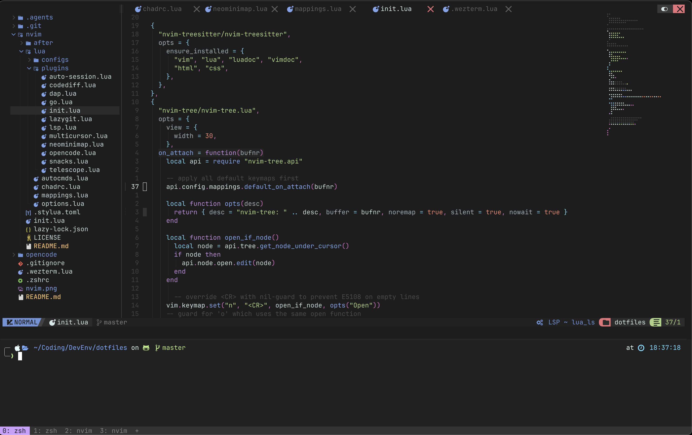

# dotfiles

Personal development environment configuration (dotfiles) for macOS. Includes shell, terminal emulator, editor, and AI agent configurations.



## Contents

| File/Directory | Description |
|---|---|
| `.zshrc` | Zsh shell configuration with Powerlevel10k prompt |
| `.wezterm.lua` | WezTerm terminal emulator configuration |
| `nvim/` | Neovim configuration based on NvChad v2.5 |
| `.agents/` | AI coding agent skill definitions |

## Setup

### Prerequisites

Install via [Homebrew](https://brew.sh/):

```sh
brew install neovim powerlevel10k zsh-autosuggestions zsh-syntax-highlighting
```

Install [WezTerm](https://wezfurlong.org/wezterm/) and a [Nerd Font](https://www.nerdfonts.com/) (JetBrains Mono is used in this config).

For Go development, install [Go](https://go.dev/) and [Delve](https://github.com/go-delve/delve) (`go install github.com/go-delve/delve/cmd/dlv@latest`).

### Installation

Clone the repository:

```sh
git clone https://github.com/s0x90/dotfiles.git ~/dotfiles
```

Symlink the configuration files to their expected locations:

```sh
ln -sf ~/dotfiles/.zshrc ~/.zshrc
ln -sf ~/dotfiles/.wezterm.lua ~/.wezterm.lua
```

#### Neovim / NvChad

This config uses [NvChad](https://nvchad.com/) v2.5 as a Neovim framework. If you already have a Neovim config, back it up first:

```sh
mv ~/.config/nvim ~/.config/nvim.bak
mv ~/.local/share/nvim ~/.local/share/nvim.bak
mv ~/.local/state/nvim ~/.local/state/nvim.bak
mv ~/.cache/nvim ~/.cache/nvim.bak
```

Then symlink the config from this repo:

```sh
ln -sf ~/dotfiles/nvim ~/.config/nvim
```

On first launch, [lazy.nvim](https://github.com/folke/lazy.nvim) will bootstrap itself, pull NvChad, and install all plugins automatically. No separate NvChad installation is needed -- it is loaded as a lazy.nvim plugin dependency.

```sh
nvim
```

Wait for the initial plugin installation to complete, then restart Neovim.

#### Claude Code

[Claude Code](https://claude.com/claude-code) is Anthropic's AI coding agent for the terminal. The
[claudecode.nvim](https://github.com/coder/claudecode.nvim) plugin runs it in a split inside Neovim
and wires up selection sharing and in-editor diff review.

Install the CLI (this is the method used on this machine -- it installs to `~/.local/bin/claude`
and self-updates, so keep `~/.local/bin` on your PATH):

```sh
curl -fsSL https://claude.ai/install.sh | bash
```

Then authenticate once:

```sh
claude
```

## Highlights

### Zsh (`.zshrc`)

- **Prompt**: Powerlevel10k with instant prompt
- **Plugins**: git (Oh-My-Zsh), zsh-autosuggestions, zsh-syntax-highlighting
- **PATH**: Homebrew, Go (`~/go/bin`), pipx (`~/.local/bin`), Docker CLI completions
- **History**: Shared across sessions with deduplication

### WezTerm (`.wezterm.lua`)

- **Leader key**: `ALT + q` (tmux-style workflow)
- **Theme**: MaterialDarker
- **Font**: JetBrains Mono, size 14
- **Max FPS**: 120
- **Tab management**: `LEADER + c/x/b/n/0-9`
- **Pane splitting**: `LEADER + \` (horizontal), `LEADER + -` (vertical)
- **Pane navigation**: `LEADER + h/j/k/l` (vim-style)
- **Pane resizing**: `LEADER + Arrow keys` (5-unit increments)

### Neovim (`nvim/`)

- **Framework**: [NvChad](https://nvchad.com/) v2.5
- **Theme**: Material Darker
- **LSP** (via mason): gopls, golangci_lint_ls, lua_ls, html, cssls, eslint, jsonls, basedpyright, dockerls, bashls, marksman, sqls, ts_ls
- **Formatting**: StyLua (Lua), gofumpt (Go, via gopls), ruff (Python)
- **Tools** (via mason, ensured at startup): stylua, ruff, debugpy. gofumpt is external: `go install mvdan.cc/gofumpt@latest` (expects `~/go/bin` on PATH)
- **Debugging**: nvim-dap + nvim-dap-ui + nvim-dap-go (Delve) + nvim-dap-python (debugpy) with virtual text
- **Go development**: go.nvim with custom test runner (colored PASS/FAIL output), struct tags, interface impl, coverage
- **Completion**: nvim-cmp with LuaSnip and friendly-snippets
- **Key plugins**: telescope.nvim, gitsigns, lazygit, auto-session, snacks.nvim, multicursor, diffmantic, codediff, claudecode.nvim
- **Custom mappings**: `<Space>` as leader, `jj` to exit insert mode, window/tab/search bindings

#### Go keybindings (active in Go files)

| Key | Action |
|---|---|
| `<leader>gt` | Run all tests |
| `<leader>gtf` | Run test function under cursor |
| `<leader>gtp` | Run package tests |
| `<leader>gF` | Run tests in current file |
| `<leader>ga` | Add struct tags |
| `<leader>ge` | Insert `if err != nil` |
| `<leader>gi` | Implement interface |
| `<leader>gf` | Fill struct |
| `<leader>gc` | Toggle coverage |
| `<leader>gm` | Go mod tidy |
| `<F5>` | Debug test |
| `<F9>` | Toggle breakpoint |
| `<F10/F11/F12>` | Step over/into/out |

#### Python keybindings (active in Python files)

| Key | Action |
|---|---|
| `<F5>` | Debug: continue/launch |
| `<F9>` | Toggle breakpoint |
| `<F10/F11/F12>` | Step over/into/out |
| `<leader>dpt` | Debug pytest method under cursor |
| `<leader>dpc` | Debug pytest class under cursor |

#### Claude Code keybindings

| Key | Action |
|---|---|
| `<leader>ac` | Toggle Claude split |
| `<C-.>` | Toggle Claude split (needs a terminal that sends CSI-u) |
| `<leader>af` | Focus Claude |
| `<leader>ar` | Resume a previous session |
| `<leader>aC` | Continue the last session |
| `<leader>am` | Select model |
| `<leader>ab` | Add current buffer to context |
| `<leader>as` | Send visual selection (or add file from nvim-tree) |
| `<leader>aa` / `<leader>ad` | Accept / deny proposed diff |
| `<leader>aq` | Close all pending diffs |

### AI Agent Skills (`.agents/`)

Skill definitions for AI coding agents (e.g., [Claude Code](https://claude.com/claude-code)):

- **critic** -- Code review with focus on edge cases, race conditions, and security
- **golangci-lint** -- Run golangci-lint after Go code changes
- **go-ddd** -- Enforce Domain-Driven Design for Go services
- **go-modern-guidelines** -- Apply modern Go syntax guidelines based on project Go version

## License

Neovim configuration is released under the [Unlicense](nvim/LICENSE). Other dotfiles have no explicit license.
